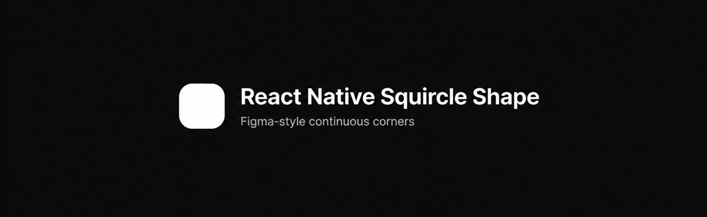

<p align="center">
  
</p>

<p align="center">
  Native Figma-style squircle <code>View</code> for React Native.
</p>

---

[![Version][version-badge]][package]
[![MIT License][license-badge]][license]

[![PRs Welcome][prs-welcome-badge]][prs-welcome]
[![Chat][chat-badge]][chat]
[![Code of Conduct][coc-badge]][coc]

## Features

- **Drop-in replacement** for `View` — just add `cornerSmoothing`
- **Figma-style** continuous corners (true squircles, not plain rounded rects)
- Native path on **iOS** and **Android** (Fabric / New Architecture)
- Works with standard styles: `borderRadius`, borders, shadows, `overflow`, and more
- Performance close to a normal `View` — no SVG

## Requirements

- React Native **0.80+** (New Architecture / Fabric)
- Not compatible with Expo Go (needs a native build / prebuild)

## Installation

```sh
npm install react-native-squircle-shape
# or
yarn add react-native-squircle-shape
```

iOS:

```sh
cd ios && pod install
```

## Usage

```tsx
import { SquircleShapeView } from 'react-native-squircle-shape';

<SquircleShapeView
  cornerSmoothing={0.6}
  style={{
    width: 120,
    height: 120,
    borderRadius: 28,
    backgroundColor: '#32a852',
    borderWidth: 2,
    borderColor: '#111',
    overflow: 'hidden',
  }}
>
  {/* children */}
</SquircleShapeView>
```

### Props

| Prop | Type | Default | Description |
|------|------|---------|-------------|
| `cornerSmoothing` | `number` | `0.6` | `0` = rounded rect, `1` = max continuous corners. Must be in `[0, 1]`. |
| ...View props | | | Standard styles: `borderRadius`, `backgroundColor`, borders, shadows, `overflow`, etc. |

## How it works

Subclasses the native RN `View` on iOS (`RCTViewComponentView`) and Android (`ReactViewGroup`), then replaces corner geometry with a Figma squircle path.

## Contributing

- [Development workflow](CONTRIBUTING.md#development-workflow)
- [Sending a pull request](CONTRIBUTING.md#sending-a-pull-request)
- [Code of conduct](CODE_OF_CONDUCT.md)

## License

MIT

Path math inspired by [figma-squircle](https://github.com/phamfoo/figma-squircle) and the View-subclass approach from [react-native-fast-squircle](https://github.com/fbeccaceci/react-native-fast-squircle).

Made with [create-react-native-library](https://github.com/callstack/react-native-builder-bob).

